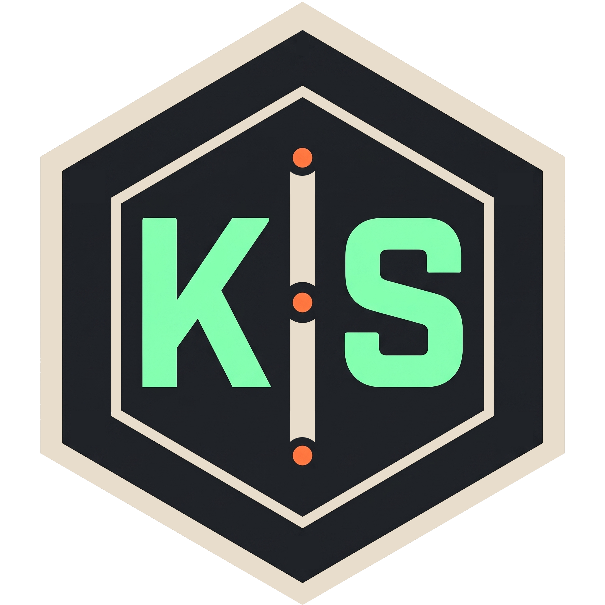
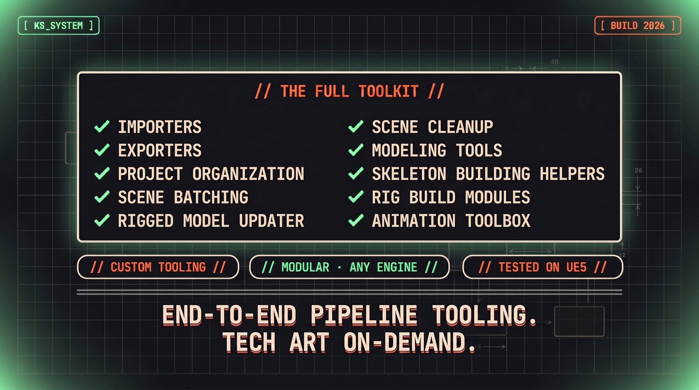
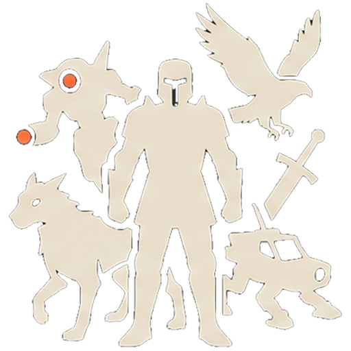
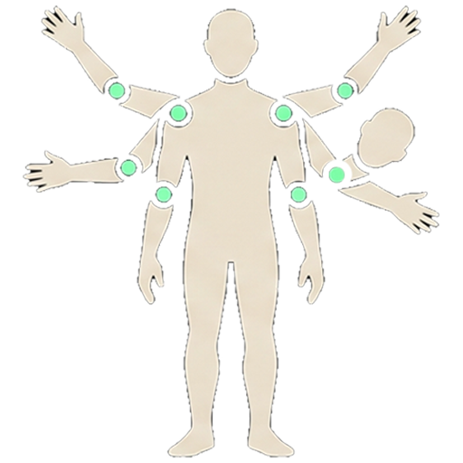
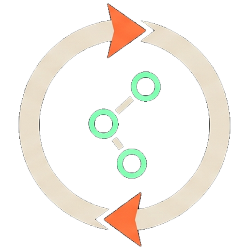
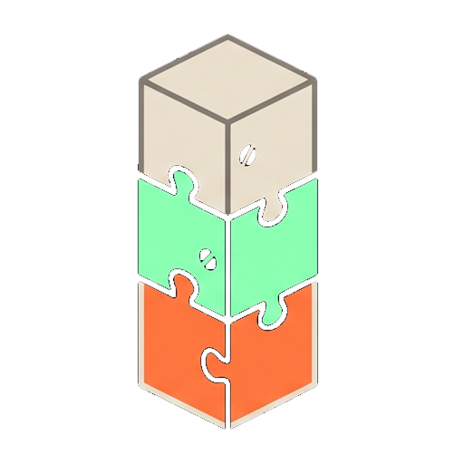
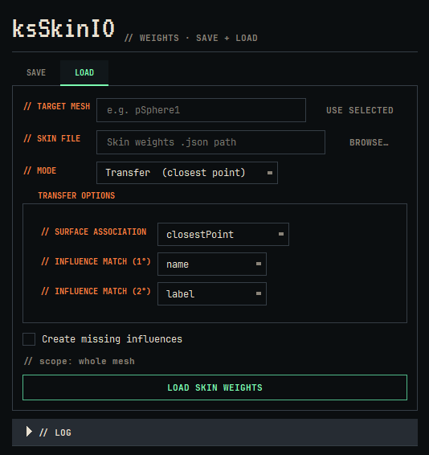
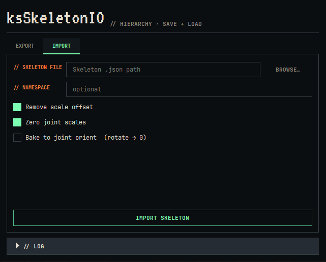
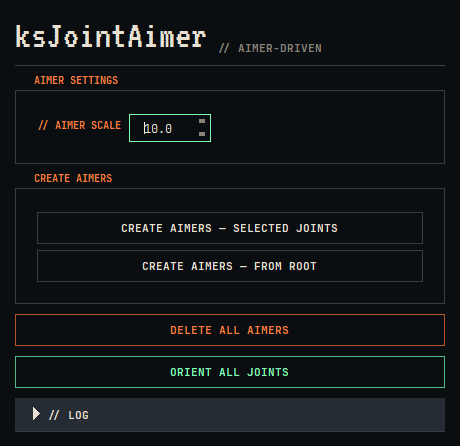
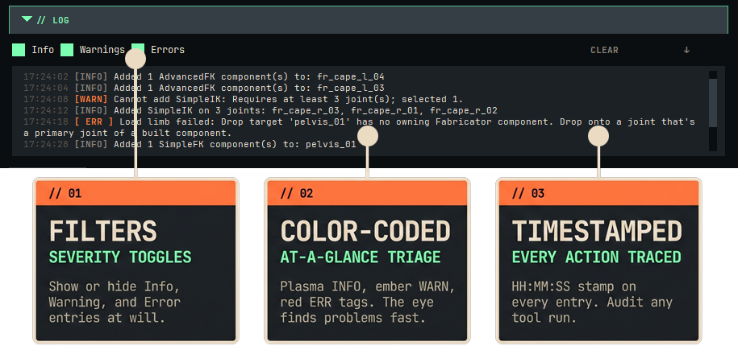

+++
title = "Kinematic Solutions: The Artist-Friendly Maya to Unreal Pipeline"
description = "The artist-friendly Maya to Unreal pipeline. A fast, modular workflow with animator-friendly rigs that work out of the box. Used in production on Archangel (UE5)."
date = "2026-05-13"

[params]
status = "in_development"
wide_body = true
hide_image_grid = true
+++

  

  
A fast, modular workflow that adapts to a project's needs. Artist-friendly tools that are easy to use, share, and grow. Animator-friendly rigs that work out of the box.

<iframe width="560" height="315" src="https://www.youtube.com/embed/Yh07bdO4FeY" title="Kinematic Solutions: The Artist-Friendly Maya to Unreal Pipeline" frameborder="0" allow="accelerometer; autoplay; clipboard-write; encrypted-media; gyroscope; picture-in-picture; web-share" referrerpolicy="strict-origin-when-cross-origin" allowfullscreen></iframe>

After the people, the backbone to every great game is its pipeline. A solid pipeline allows creators to concentrate on their craft and not have to worry about the overhead of moving assets through technical gates. It's best when things just work and the artists don't even notice the tools.

<nav class="ks-toc" aria-label="Tools in this page">
  
// TABLE OF CONTENTS //

  <ul class="ks-toc__list">
    <li><a href="#fabricator">Fabricator</a></li>
    <li><a href="#pose-anim-library">Pose &amp; Animation Library</a></li>
    <li><a href="#autoskin">AutoSkin</a></li>
    <li><a href="#skin-skeleton-io">Skin/Skeleton IO</a></li>
    <li><a href="#aimer">Aimer</a></li>
    <li><a href="#exporters">Mesh &amp; Animation Exporter</a></li>
    <li><a href="#batcher">Batcher</a></li>
  </ul>
</nav>




The flagship rigging architecture. Create rigs intuitively by dragging and dropping components and limbs from the component palette to your rig canvas. Save entire rig blueprints, or just Limb sections of a rig, to use on other assets. Edit control rigs and even the skeleton on the fly, non-destructively. Rigs can be created and destroyed instantly, making rigging an iterative, artist-friendly process. This non-linear approach lets you iterate your way to the perfect rig for every asset.

  

  
Create humans, creatures, quadrupeds, weapons, props, vehicles. There is no limit.

  

  
Any type of configuration is possible. 6 arms and a head on an elbow? Fabricator can build it.

  

  
Non-Destructive Iterative Workflow. Build and unbuild at will until you create the perfect rig.

  

  
Intuitively build rigs using components, like stacking blocks.

  

  
Animator Friendly Rigs. Controls built under the philosophy that the animator should enjoy using the rig. Heavily inspired by Jason Schleifer's Animator Friendly Rigs.



<video class="ks-demo-video" src="fab_animation.mp4" autoplay loop muted playsinline></video>




Save and recall poses and animation clips. Both libraries share the same architecture: cross-rig portability, interactive thumbnail or gif framing, search bar, user-authored sets. Apply to full rigs or selected controls. Mirror Pose and Mirror Selected provide one-click pose mirroring on full rigs or control subsets.






AutoSkin is a way to get working skin weights fast. With some light cleanup, assets are production ready. Choose from different bind methods, including BBW and Geodesic Voxel, apply Deformers, and bake them back down to an engine-ready skinCluster.



<video class="ks-demo-video" src="autoskin.mp4" autoplay loop muted playsinline></video>




Skin IO saves and loads skin weights to JSON via Direct and Transfer modes. Skeleton IO saves and loads joint hierarchies via world-matrix decomposition (handles any rotate order, UE5 convention). Both pair cleanly with the rest of the pipeline: stamp a rig once, rebuild it anywhere.

  
  




ksJointAimer brings an aimer-driven orient workflow to Maya. XYZ aimers per joint, enum-dispatched targets, all via pure DG (no scriptJobs). Build orientations with confidence, sweep across long chains, and never lose track of which axis points where.

  
  <video src="aimers.mp4" autoplay loop muted playsinline></video>




Static mesh, skeletal mesh, and animation export through one unified pipeline. The multi-entry UI persists across scene loads via network nodes, so each scene remembers what to export. Define multiple animation clips per scene and batch-export them all in one pass. Animation export runs via mayapy subprocess to sidestep mtoa scriptJob corruption that would otherwise destabilize Maya GUI batch runs. Built on AM_RigBinding, the cross-tool rig contract that lets every pipeline tool find a rig's controls, joints, and groups by identity rather than by name.






Scene Batch runs Python scripts, FBX exports, and scene saves across a list of files. Drop in a folder, queue the operation, walk away. Powers the heavy lifting whenever something needs to happen across an entire project.







<section id="logger" class="ks-feature-card">
  
Universal Logger

  
Built into every KS tool

  

    
Every KS tool ships with the same logger at the bottom of its window. Color-coded INFO, WARN, and ERR tags with severity filters, timestamped entries, one-click clear. Wherever you are in the pipeline, the logger looks the same and works the same. Every action you take is traceable.

    
  

</section>

---

**Built with:** Maya 2025 · Python 3.11 · PySide6
**Tested with:** Unreal Engine 5

Everything built by Adrian Melian, Technical Artist.
